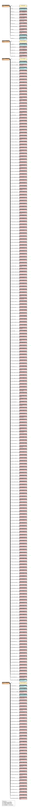

# tcga_RDF config (senbero)

RDF-config is a tool to generate SPARQL queries, a schema diagram, and files required for [Grasp](https://github.com/dbcls/grasp), [TogoStanza](http://togostanza.org/) and ShEx validator from the simple YAML-based configuration files (see the [specification](./doc/spec.md)).


## TODO

* implement
  * support multiple models to be loaded in combination at once
* test

## GOAL

* DONE: capture the RDF data strucuture in ease
* DONE: generate SPARQL queries
* DONE: generate Grasp config file
* DONE: generate schema chart
* DONE: generate TogoStanza
* DONE: generate ShEx for RDF validation (data type and cardinality)
* generate SPARQLet for SPARQList

## SPECIFICATION

* [English version](./doc/spec.md)
* [Japanese version](./doc/spec_ja.md)

## USAGE

### Installation

```
% git clone https://github.com/dbcls/rdf-config.git
% cd rdf-config
% bundle install
```

### Generate schema ascii art

```
% bundle exec rdf-config --config config/tcga --senbero
TcgaFiles [tcgaf:TcgaFiles] (tcgaf:1)
    |-- tcgaf:file_id
    |       `-- file_id (tcgaf:a9de4ee0-bf86-482...)
    |-- tcgaf:file_name
    |       `-- file_name ("TCGA_LUSC.eaf3905...")
    |-- tcgaf:file_size
    |       `-- file_size (401704810042)
    |-- tcgaf:data_type
    |       `-- data_type ("Annotated Somatic...")
    |-- tcgaf:data_category
    |       `-- data_category ("Simple Nucleotide...")
    |-- tcgaf:data_format
    |       `-- data_format ("VCF")
    |-- tcgaf:experimental_strategy
    |       `-- experimental_strategy ("WXS")
    |-- tcgaf:platform
    |       `-- platform ("Affymetrix SNP 6.0")
    |-- tcgaf:access
    |       `-- access ("controlled")
    |-- tcgaf:case_id
    |       `-- case_id (tcgaa:dbece124-c042-4ad...)
    `-- tcgaf:project_id
            `-- project_id (tcgap:TCGA-LUSC)
TcgaManifeset [tcgam:TcgaManifest] (tcgam:1)
    |-- tcgam:mani_id
    |       `-- mani_id (tcgam:a9de4ee0-bf86-482...)
    |-- tcgam:mani_filename
    |       `-- mani_filename ("TCGA_LUSC.eaf3905...")
    |-- tcgam:mani_md5
    |       `-- mani_md5 ("d3ee6b811a08c6e3c...")
    |-- tcgam:mani_size
    |       `-- mani_size (401704810042)
    `-- tcgam:mani_state
            `-- mani_state ("released")
TcgaClinical [tcgac:TcgaClinical] (tcgac:1)
    |-- tcgac:clin_case_id
    |       `-- clin_case_id (tcgaa:0304b12d-7640-415...)
    |-- tcgac:clin_case_submitter_id
    |       `-- clin_case_submitter_id ("TCGA-OR-A5LL")
    |-- tcgac:clin_project_id
    |       `-- clin_project_id (tcgap:TCGA-ACC)
    |-- tcgac:clin_age_at_index
    |       `-- clin_age_at_index (75)
    |-- tcgac:clin_age_is_obfuscated
    |       `-- clin_age_is_obfuscated ("--")
    |-- tcgac:clin_cause_of_death
    |       `-- clin_cause_of_death ("--")
    |-- tcgac:clin_cause_of_death_source
    |       `-- clin_cause_of_death_source ("--")
    |-- tcgac:clin_country_of_birth
    |       `-- clin_country_of_birth ("--")
    |-- tcgac:clin_country_of_residence_at_enrollment
    |       `-- clin_country_of_residence_at_enrollment ("--")
    |-- tcgac:clin_days_to_birth
    |       `-- clin_days_to_birth (-27607)
    |-- tcgac:clin_days_to_death
    |       `-- clin_days_to_death (10346)
    |-- tcgac:clin_education_level
    |       `-- clin_education_level ("--")
    |-- tcgac:clin_ethnicity
    |       `-- clin_ethnicity ("not reported")
    |-- tcgac:clin_gender
    |       `-- clin_gender ("female")
    |-- tcgac:clin_marital_status
    |       `-- clin_marital_status ("--")
    |-- tcgac:clin_occupation_duration_years
    |       `-- clin_occupation_duration_years ("--")
    |-- tcgac:clin_premature_at_birth
    |       `-- clin_premature_at_birth ("--")
    |-- tcgac:clin_race
    |       `-- clin_race ("not reported")
    |-- tcgac:clin_vital_status
    |       `-- clin_vital_status ("Dead")
    |-- tcgac:clin_weeks_gestation_at_birth
    |       `-- clin_weeks_gestation_at_birth ("--")
    |-- tcgac:clin_year_of_birth
    |       `-- clin_year_of_birth (1932)
    |-- tcgac:clin_year_of_death
    |       `-- clin_year_of_death (2011)
    |-- tcgac:clin_adrenal_hormone
    |       `-- clin_adrenal_hormone ("--")
    |-- tcgac:clin_age_at_diagnosis
    |       `-- clin_age_at_diagnosis (27607)
    |-- tcgac:clin_ajcc_clinical_m
    |       `-- clin_ajcc_clinical_m ("M0")
    |-- tcgac:clin_ajcc_clinical_n
    |       `-- clin_ajcc_clinical_n ("NX")
    |-- tcgac:clin_ajcc_clinical_stage
    |       `-- clin_ajcc_clinical_stage ("Stage IA")
    |-- tcgac:clin_ajcc_clinical_t
    |       `-- clin_ajcc_clinical_t ("T2")
    |-- tcgac:clin_ajcc_pathologic_m
    |       `-- clin_ajcc_pathologic_m ("M0")
    |-- tcgac:clin_ajcc_pathologic_n
    |       `-- clin_ajcc_pathologic_n ("N0")
    |-- tcgac:clin_ajcc_pathologic_stage
    |       `-- clin_ajcc_pathologic_stage ("Stage II")
    |-- tcgac:clin_ajcc_pathologic_t
    |       `-- clin_ajcc_pathologic_t ("T2")
    |-- tcgac:clin_ajcc_staging_system_edition
    |       `-- clin_ajcc_staging_system_edition ("6th")
    |-- tcgac:clin_ann_arbor_b_symptoms
    |       `-- clin_ann_arbor_b_symptoms (false)
    |-- tcgac:clin_ann_arbor_b_symptoms_described
    |       `-- clin_ann_arbor_b_symptoms_described ("--")
    |-- tcgac:clin_ann_arbor_clinical_stage
    |       `-- clin_ann_arbor_clinical_stage ("Stage I")
    |-- tcgac:clin_ann_arbor_extranodal_involvement
    |       `-- clin_ann_arbor_extranodal_involvement (false)
    |-- tcgac:clin_ann_arbor_pathologic_stage
    |       `-- clin_ann_arbor_pathologic_stage ("--")
    |-- tcgac:clin_best_overall_response
    |       `-- clin_best_overall_response ("--")
    |-- tcgac:clin_burkitt_lymphoma_clinical_variant
    |       `-- clin_burkitt_lymphoma_clinical_variant ("--")
    |-- tcgac:clin_cancer_detection_method
    |       `-- clin_cancer_detection_method ("--")
    |-- tcgac:clin_child_pugh_classification
    |       `-- clin_child_pugh_classification ("--")
    |-- tcgac:clin_clark_level
    |       `-- clin_clark_level ("--")
    |-- tcgac:clin_classification_of_tumor
    |       `-- clin_classification_of_tumor ("not reported")
    |-- tcgac:clin_cog_liver_stage
    |       `-- clin_cog_liver_stage ("--")
    |-- tcgac:clin_cog_neuroblastoma_risk_group
    |       `-- clin_cog_neuroblastoma_risk_group ("--")
    |-- tcgac:clin_cog_renal_stage
    |       `-- clin_cog_renal_stage ("--")
    |-- tcgac:clin_cog_rhabdomyosarcoma_risk_group
    |       `-- clin_cog_rhabdomyosarcoma_risk_group ("--")
    |-- tcgac:clin_contiguous_organ_invaded
    |       `-- clin_contiguous_organ_invaded ("--")
    |-- tcgac:clin_days_to_best_overall_response
    |       `-- clin_days_to_best_overall_response ("--")
    |-- tcgac:clin_days_to_diagnosis
    |       `-- clin_days_to_diagnosis (0)
    |-- tcgac:clin_days_to_last_follow_up
    |       `-- clin_days_to_last_follow_up (11252.0)
    |-- tcgac:clin_days_to_last_known_disease_status
    |       `-- clin_days_to_last_known_disease_status ("--")
    |-- tcgac:clin_days_to_recurrence
    |       `-- clin_days_to_recurrence ("--")
    |-- tcgac:clin_diagnosis_is_primary_disease
    |       `-- clin_diagnosis_is_primary_disease ("--")
    |-- tcgac:clin_double_expressor_lymphoma
    |       `-- clin_double_expressor_lymphoma ("--")
    |-- tcgac:clin_double_hit_lymphoma
    |       `-- clin_double_hit_lymphoma ("--")
    |-- tcgac:clin_eln_risk_classification
    |       `-- clin_eln_risk_classification ("--")
    |-- tcgac:clin_enneking_msts_grade
    |       `-- clin_enneking_msts_grade ("--")
    |-- tcgac:clin_enneking_msts_metastasis
    |       `-- clin_enneking_msts_metastasis ("--")
    |-- tcgac:clin_enneking_msts_stage
    |       `-- clin_enneking_msts_stage ("--")
    |-- tcgac:clin_enneking_msts_tumor_site
    |       `-- clin_enneking_msts_tumor_site ("--")
    |-- tcgac:clin_ensat_clinical_m
    |       `-- clin_ensat_clinical_m ("--")
    |-- tcgac:clin_ensat_pathologic_n
    |       `-- clin_ensat_pathologic_n ("--")
    |-- tcgac:clin_ensat_pathologic_stage
    |       `-- clin_ensat_pathologic_stage ("--")
    |-- tcgac:clin_ensat_pathologic_t
    |       `-- clin_ensat_pathologic_t ("--")
    |-- tcgac:clin_esophageal_columnar_dysplasia_degree
    |       `-- clin_esophageal_columnar_dysplasia_degree ("--")
    |-- tcgac:clin_esophageal_columnar_metaplasia_present
    |       `-- clin_esophageal_columnar_metaplasia_present ("--")
    |-- tcgac:clin_fab_morphology_code
    |       `-- clin_fab_morphology_code ("--")
    |-- tcgac:clin_figo_stage
    |       `-- clin_figo_stage ("Stage IB1")
    |-- tcgac:clin_figo_staging_edition_year
    |       `-- clin_figo_staging_edition_year ("--")
    |-- tcgac:clin_first_symptom_longest_duration
    |       `-- clin_first_symptom_longest_duration ("--")
    |-- tcgac:clin_first_symptom_prior_to_diagnosis
    |       `-- clin_first_symptom_prior_to_diagnosis ("--")
    |-- tcgac:clin_gastric_esophageal_junction_involvement
    |       `-- clin_gastric_esophageal_junction_involvement ("--")
    |-- tcgac:clin_gleason_grade_group
    |       `-- clin_gleason_grade_group ("--")
    |-- tcgac:clin_gleason_grade_tertiary
    |       `-- clin_gleason_grade_tertiary ("--")
    |-- tcgac:clin_gleason_patterns_percent
    |       `-- clin_gleason_patterns_percent ("--")
    |-- tcgac:clin_gleason_score
    |       `-- clin_gleason_score ("--")
    |-- tcgac:clin_goblet_cells_columnar_mucosa_present
    |       `-- clin_goblet_cells_columnar_mucosa_present ("--")
    |-- tcgac:clin_icd_10_code
    |       `-- clin_icd_10_code ("C74.0")
    |-- tcgac:clin_igcccg_stage
    |       `-- clin_igcccg_stage ("Good Prognosis")
    |-- tcgac:clin_inpc_grade
    |       `-- clin_inpc_grade ("--")
    |-- tcgac:clin_inpc_histologic_group
    |       `-- clin_inpc_histologic_group ("--")
    |-- tcgac:clin_inrg_stage
    |       `-- clin_inrg_stage ("--")
    |-- tcgac:clin_inss_stage
    |       `-- clin_inss_stage ("--")
    |-- tcgac:clin_international_prognostic_index
    |       `-- clin_international_prognostic_index ("--")
    |-- tcgac:clin_irs_group
    |       `-- clin_irs_group ("--")
    |-- tcgac:clin_irs_stage
    |       `-- clin_irs_stage ("--")
    |-- tcgac:clin_ishak_fibrosis_score
    |       `-- clin_ishak_fibrosis_score ("--")
    |-- tcgac:clin_iss_stage
    |       `-- clin_iss_stage ("--")
    |-- tcgac:clin_last_known_disease_status
    |       `-- clin_last_known_disease_status ("not reported")
    |-- tcgac:clin_laterality
    |       `-- clin_laterality ("--")
    |-- tcgac:clin_margin_distance
    |       `-- clin_margin_distance ("--")
    |-- tcgac:clin_margins_involved_site
    |       `-- clin_margins_involved_site ("--")
    |-- tcgac:clin_masaoka_stage
    |       `-- clin_masaoka_stage ("Stage III")
    |-- tcgac:clin_max_tumor_bulk_site
    |       `-- clin_max_tumor_bulk_site ("--")
    |-- tcgac:clin_medulloblastoma_molecular_classification
    |       `-- clin_medulloblastoma_molecular_classification ("--")
    |-- tcgac:clin_melanoma_known_primary
    |       `-- clin_melanoma_known_primary ("--")
    |-- tcgac:clin_metastasis_at_diagnosis
    |       `-- clin_metastasis_at_diagnosis ("--")
    |-- tcgac:clin_metastasis_at_diagnosis_site
    |       `-- clin_metastasis_at_diagnosis_site ("--")
    |-- tcgac:clin_method_of_diagnosis
    |       `-- clin_method_of_diagnosis ("--")
    |-- tcgac:clin_micropapillary_features
    |       `-- clin_micropapillary_features ("--")
    |-- tcgac:clin_mitosis_karyorrhexis_index
    |       `-- clin_mitosis_karyorrhexis_index ("--")
    |-- tcgac:clin_mitotic_count
    |       `-- clin_mitotic_count ("--")
    |-- tcgac:clin_morphology
    |       `-- clin_morphology ("8370/3")
    |-- tcgac:clin_ovarian_specimen_status
    |       `-- clin_ovarian_specimen_status ("--")
    |-- tcgac:clin_ovarian_surface_involvement
    |       `-- clin_ovarian_surface_involvement ("--")
    |-- tcgac:clin_papillary_renal_cell_type
    |       `-- clin_papillary_renal_cell_type ("--")
    |-- tcgac:clin_pediatric_kidney_staging
    |       `-- clin_pediatric_kidney_staging ("--")
    |-- tcgac:clin_peritoneal_fluid_cytological_status
    |       `-- clin_peritoneal_fluid_cytological_status ("--")
    |-- tcgac:clin_pregnant_at_diagnosis
    |       `-- clin_pregnant_at_diagnosis ("--")
    |-- tcgac:clin_primary_diagnosis
    |       `-- clin_primary_diagnosis ("Adrenal cortical ...")
    |-- tcgac:clin_primary_disease
    |       `-- clin_primary_disease ("--")
    |-- tcgac:clin_primary_gleason_grade
    |       `-- clin_primary_gleason_grade ("Pattern 4")
    |-- tcgac:clin_prior_malignancy
    |       `-- clin_prior_malignancy (false)
    |-- tcgac:clin_prior_treatment
    |       `-- clin_prior_treatment (false)
    |-- tcgac:clin_progression_or_recurrence
    |       `-- clin_progression_or_recurrence ("not reported")
    |-- tcgac:clin_residual_disease
    |       `-- clin_residual_disease ("--")
    |-- tcgac:clin_satellite_nodule_present
    |       `-- clin_satellite_nodule_present ("--")
    |-- tcgac:clin_secondary_gleason_grade
    |       `-- clin_secondary_gleason_grade ("--")
    |-- tcgac:clin_site_of_resection_or_biopsy
    |       `-- clin_site_of_resection_or_biopsy ("Cortex of adrenal...")
    |-- tcgac:clin_sites_of_involvement
    |       `-- clin_sites_of_involvement ("--")
    |-- tcgac:clin_sites_of_involvement_count
    |       `-- clin_sites_of_involvement_count ("--")
    |-- tcgac:clin_supratentorial_localization
    |       `-- clin_supratentorial_localization ("--")
    |-- tcgac:clin_synchronous_malignancy
    |       `-- clin_synchronous_malignancy (false)
    |-- tcgac:clin_tissue_or_organ_of_origin
    |       `-- clin_tissue_or_organ_of_origin ("Cortex of adrenal...")
    |-- tcgac:clin_tumor_burden
    |       `-- clin_tumor_burden ("--")
    |-- tcgac:clin_tumor_confined_to_organ_of_origin
    |       `-- clin_tumor_confined_to_organ_of_origin ("--")
    |-- tcgac:clin_tumor_depth
    |       `-- clin_tumor_depth ("--")
    |-- tcgac:clin_tumor_focality
    |       `-- clin_tumor_focality ("--")
    |-- tcgac:clin_tumor_grade
    |       `-- clin_tumor_grade ("Not Reported")
    |-- tcgac:clin_tumor_grade_category
    |       `-- clin_tumor_grade_category ("--")
    |-- tcgac:clin_tumor_regression_grade
    |       `-- clin_tumor_regression_grade ("--")
    |-- tcgac:clin_uicc_clinical_m
    |       `-- clin_uicc_clinical_m ("--")
    |-- tcgac:clin_uicc_clinical_n
    |       `-- clin_uicc_clinical_n ("--")
    |-- tcgac:clin_uicc_clinical_stage
    |       `-- clin_uicc_clinical_stage ("--")
    |-- tcgac:clin_uicc_clinical_t
    |       `-- clin_uicc_clinical_t ("--")
    |-- tcgac:clin_uicc_pathologic_m
    |       `-- clin_uicc_pathologic_m ("--")
    |-- tcgac:clin_uicc_pathologic_n
    |       `-- clin_uicc_pathologic_n ("--")
    |-- tcgac:clin_uicc_pathologic_stage
    |       `-- clin_uicc_pathologic_stage ("--")
    |-- tcgac:clin_uicc_pathologic_t
    |       `-- clin_uicc_pathologic_t ("--")
    |-- tcgac:clin_uicc_staging_system_edition
    |       `-- clin_uicc_staging_system_edition ("--")
    |-- tcgac:clin_ulceration_indicator
    |       `-- clin_ulceration_indicator ("--")
    |-- tcgac:clin_weiss_assessment_findings
    |       `-- clin_weiss_assessment_findings ("--")
    |-- tcgac:clin_weiss_assessment_score
    |       `-- clin_weiss_assessment_score ("--")
    |-- tcgac:clin_who_cns_grade
    |       `-- clin_who_cns_grade ("--")
    |-- tcgac:clin_who_nte_grade
    |       `-- clin_who_nte_grade ("--")
    |-- tcgac:clin_wilms_tumor_histologic_subtype
    |       `-- clin_wilms_tumor_histologic_subtype ("--")
    |-- tcgac:clin_year_of_diagnosis
    |       `-- clin_year_of_diagnosis (2007)
    |-- tcgac:clin_anaplasia_present
    |       `-- clin_anaplasia_present ("--")
    |-- tcgac:clin_anaplasia_present_type
    |       `-- clin_anaplasia_present_type ("--")
    |-- tcgac:clin_breslow_thickness
    |       `-- clin_breslow_thickness ("--")
    |-- tcgac:clin_circumferential_resection_margin
    |       `-- clin_circumferential_resection_margin ("--")
    |-- tcgac:clin_greatest_tumor_dimension
    |       `-- clin_greatest_tumor_dimension ("--")
    |-- tcgac:clin_gross_tumor_weight
    |       `-- clin_gross_tumor_weight ("--")
    |-- tcgac:clin_largest_extrapelvic_peritoneal_focus
    |       `-- clin_largest_extrapelvic_peritoneal_focus ("--")
    |-- tcgac:clin_lymph_node_involved_site
    |       `-- clin_lymph_node_involved_site ("--")
    |-- tcgac:clin_lymph_nodes_positive
    |       `-- clin_lymph_nodes_positive ("--")
    |-- tcgac:clin_lymph_nodes_tested
    |       `-- clin_lymph_nodes_tested ("--")
    |-- tcgac:clin_lymphatic_invasion_present
    |       `-- clin_lymphatic_invasion_present ("--")
    |-- tcgac:clin_non_nodal_regional_disease
    |       `-- clin_non_nodal_regional_disease ("--")
    |-- tcgac:clin_non_nodal_tumor_deposits
    |       `-- clin_non_nodal_tumor_deposits ("--")
    |-- tcgac:clin_percent_tumor_invasion
    |       `-- clin_percent_tumor_invasion ("--")
    |-- tcgac:clin_perineural_invasion_present
    |       `-- clin_perineural_invasion_present ("--")
    |-- tcgac:clin_peripancreatic_lymph_nodes_positive
    |       `-- clin_peripancreatic_lymph_nodes_positive ("--")
    |-- tcgac:clin_peripancreatic_lymph_nodes_tested
    |       `-- clin_peripancreatic_lymph_nodes_tested ("--")
    |-- tcgac:clin_transglottic_extension
    |       `-- clin_transglottic_extension ("--")
    |-- tcgac:clin_tumor_largest_dimension_diameter
    |       `-- clin_tumor_largest_dimension_diameter ("--")
    |-- tcgac:clin_tumor_stage
    |       `-- clin_tumor_stage ("--")
    |-- tcgac:clin_vascular_invasion_present
    |       `-- clin_vascular_invasion_present ("--")
    |-- tcgac:clin_vascular_invasion_type
    |       `-- clin_vascular_invasion_type ("--")
    |-- tcgac:clin_chemo_concurrent_to_radiation
    |       `-- clin_chemo_concurrent_to_radiation ("--")
    |-- tcgac:clin_clinical_trial_indicator
    |       `-- clin_clinical_trial_indicator ("--")
    |-- tcgac:clin_course_number
    |       `-- clin_course_number ("--")
    |-- tcgac:clin_days_to_treatment_end
    |       `-- clin_days_to_treatment_end ("--")
    |-- tcgac:clin_days_to_treatment_start
    |       `-- clin_days_to_treatment_start ("--")
    |-- tcgac:clin_drug_category
    |       `-- clin_drug_category ("--")
    |-- tcgac:clin_embolic_agent
    |       `-- clin_embolic_agent ("--")
    |-- tcgac:clin_initial_disease_status
    |       `-- clin_initial_disease_status ("--")
    |-- tcgac:clin_lesions_treated_number
    |       `-- clin_lesions_treated_number ("--")
    |-- tcgac:clin_number_of_cycles
    |       `-- clin_number_of_cycles ("--")
    |-- tcgac:clin_number_of_fractions
    |       `-- clin_number_of_fractions ("--")
    |-- tcgac:clin_prescribed_dose
    |       `-- clin_prescribed_dose ("--")
    |-- tcgac:clin_protocol_identifier
    |       `-- clin_protocol_identifier ("--")
    |-- tcgac:clin_radiosensitizing_agent
    |       `-- clin_radiosensitizing_agent ("--")
    |-- tcgac:clin_reason_treatment_ended
    |       `-- clin_reason_treatment_ended ("--")
    |-- tcgac:clin_reason_treatment_not_given
    |       `-- clin_reason_treatment_not_given ("--")
    |-- tcgac:clin_regimen_or_line_of_therapy
    |       `-- clin_regimen_or_line_of_therapy ("--")
    |-- tcgac:clin_route_of_administration
    |       `-- clin_route_of_administration ("--")
    |-- tcgac:clin_therapeutic_agents
    |       `-- clin_therapeutic_agents ("--")
    |-- tcgac:clin_therapeutic_level_achieved
    |       `-- clin_therapeutic_level_achieved ("--")
    |-- tcgac:clin_therapeutic_levels_achieved
    |       `-- clin_therapeutic_levels_achieved ("--")
    |-- tcgac:clin_therapeutic_target_level
    |       `-- clin_therapeutic_target_level ("--")
    |-- tcgac:clin_timepoint_category
    |       `-- clin_timepoint_category ("--")
    |-- tcgac:clin_treatment_anatomic_site
    |       `-- clin_treatment_anatomic_site ("--")
    |-- tcgac:clin_treatment_anatomic_sites
    |       `-- clin_treatment_anatomic_sites ("--")
    |-- tcgac:clin_treatment_arm
    |       `-- clin_treatment_arm ("--")
    |-- tcgac:clin_treatment_dose
    |       `-- clin_treatment_dose ("--")
    |-- tcgac:clin_treatment_dose_max
    |       `-- clin_treatment_dose_max ("--")
    |-- tcgac:clin_treatment_dose_units
    |       `-- clin_treatment_dose_units ("--")
    |-- tcgac:clin_treatment_duration
    |       `-- clin_treatment_duration ("--")
    |-- tcgac:clin_treatment_effect
    |       `-- clin_treatment_effect ("--")
    |-- tcgac:clin_treatment_effect_indicator
    |       `-- clin_treatment_effect_indicator ("--")
    |-- tcgac:clin_treatment_frequency
    |       `-- clin_treatment_frequency ("--")
    |-- tcgac:clin_treatment_intent_type
    |       `-- clin_treatment_intent_type ("--")
    |-- tcgac:clin_treatment_or_therapy
    |       `-- clin_treatment_or_therapy (true)
    |-- tcgac:clin_treatment_outcome
    |       `-- clin_treatment_outcome ("--")
    |-- tcgac:clin_treatment_outcome_duration
    |       `-- clin_treatment_outcome_duration ("--")
    |-- tcgac:clin_treatment_type
    |       `-- clin_treatment_type ("Pharmaceutical Th...")
    `-- tcgac:clin_case_id___treatment_type
            `-- clin_case_id___treatment_type (tcgac:hogehoge)
TcgaSample [tcgas:TcgaSample] (tcgas:1)
    |-- tcgas:smpl_project_id
    |       `-- smpl_project_id (tcgap:TCGA-ACC)
    |-- tcgas:smpl_case_id
    |       `-- smpl_case_id (tcgaa:f13a3d5e-7f8e-4ac...)
    |-- tcgas:smpl_case_submitter_id
    |       `-- smpl_case_submitter_id ("TCGA-OR-A5L6")
    |-- tcgas:smpl_sample_id
    |       `-- smpl_sample_id (tcgas:0f19f2d5-d552-4f7...)
    |-- tcgas:smpl_sample_submitter_id
    |       `-- smpl_sample_submitter_id ("TCGA-OR-A5L6-01A")
    |-- tcgas:smpl_biospecimen_anatomic_site
    |       `-- smpl_biospecimen_anatomic_site ("--")
    |-- tcgas:smpl_biospecimen_laterality
    |       `-- smpl_biospecimen_laterality ("--")
    |-- tcgas:smpl_catalog_reference
    |       `-- smpl_catalog_reference ("--")
    |-- tcgas:smpl_composition
    |       `-- smpl_composition ("Not Reported")
    |-- tcgas:smpl_current_weight
    |       `-- smpl_current_weight ("--")
    |-- tcgas:smpl_days_to_collection
    |       `-- smpl_days_to_collection ("--")
    |-- tcgas:smpl_days_to_sample_procurement
    |       `-- smpl_days_to_sample_procurement ("--")
    |-- tcgas:smpl_diagnosis_pathologically_confirmed
    |       `-- smpl_diagnosis_pathologically_confirmed ("--")
    |-- tcgas:smpl_distance_normal_to_tumor
    |       `-- smpl_distance_normal_to_tumor ("--")
    |-- tcgas:smpl_distributor_reference
    |       `-- smpl_distributor_reference ("--")
    |-- tcgas:smpl_freezing_method
    |       `-- smpl_freezing_method ("--")
    |-- tcgas:smpl_growth_rate
    |       `-- smpl_growth_rate ("--")
    |-- tcgas:smpl_initial_weight
    |       `-- smpl_initial_weight (1670.0)
    |-- tcgas:smpl_intermediate_dimension
    |       `-- smpl_intermediate_dimension ("--")
    |-- tcgas:smpl_is_ffpe
    |       `-- smpl_is_ffpe (false)
    |-- tcgas:smpl_longest_dimension
    |       `-- smpl_longest_dimension ("--")
    |-- tcgas:smpl_method_of_sample_procurement
    |       `-- smpl_method_of_sample_procurement ("--")
    |-- tcgas:smpl_oct_embedded
    |       `-- smpl_oct_embedded (true)
    |-- tcgas:smpl_passage_count
    |       `-- smpl_passage_count ("--")
    |-- tcgas:smpl_pathology_report_uuid
    |       `-- smpl_pathology_report_uuid ("6104CA0C-86CD-46C...")
    |-- tcgas:smpl_preservation_method
    |       `-- smpl_preservation_method ("OCT")
    |-- tcgas:smpl_sample_ordinal
    |       `-- smpl_sample_ordinal ("--")
    |-- tcgas:smpl_sample_type
    |       `-- smpl_sample_type ("Primary Tumor")
    |-- tcgas:smpl_sample_type_id
    |       `-- smpl_sample_type_id (1)
    |-- tcgas:smpl_shortest_dimension
    |       `-- smpl_shortest_dimension ("--")
    |-- tcgas:smpl_specimen_type
    |       `-- smpl_specimen_type ("Solid Tissue")
    |-- tcgas:smpl_state
    |       `-- smpl_state ("released")
    |-- tcgas:smpl_time_between_clamping_and_freezing
    |       `-- smpl_time_between_clamping_and_freezing ("--")
    |-- tcgas:smpl_time_between_excision_and_freezing
    |       `-- smpl_time_between_excision_and_freezing ("--")
    |-- tcgas:smpl_tissue_collection_type
    |       `-- smpl_tissue_collection_type ("--")
    |-- tcgas:smpl_tissue_type
    |       `-- smpl_tissue_type ("Tumor")
    |-- tcgas:smpl_tumor_code
    |       `-- smpl_tumor_code ("--")
    |-- tcgas:smpl_tumor_code_id
    |       `-- smpl_tumor_code_id ("--")
    `-- tcgas:smpl_tumor_descriptor
            `-- smpl_tumor_descriptor ("Primary")

```

### Generate schema diagram

```
% bundle exec rdf-config --config config/tcga --schema > tcga.svg
```



### Generate RDF or JSON-LD

To generate RDF or JSON-LD from CSV, XML, or JSON files, run rdf-config with the --convert option.

```
% rdf-config --config [directory of the configuration file] --convert [--format output format]
```

To generate Turtle
```
% bundle exec rdf-config --config config/tcga --convert --format turtle > config/tcga/output.ttl
```

To generate JSON-LD

```
% bundle exec rdf-config --config config/tcga --convert --format json-ld > config/tcga/output.json
```

