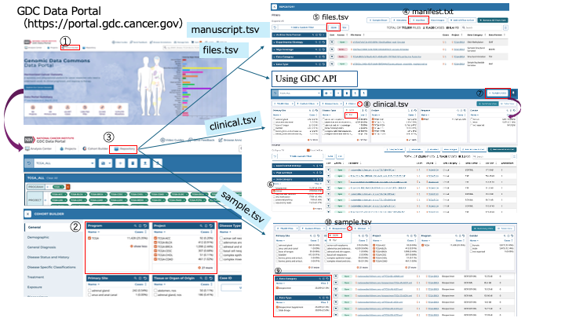

# tcga

The Cancer Genome Atlas (TCGA) provides large-scale genetic data to study cancer-related mutations and expression patterns.

## tcga Conversion with RDF-config

### RDF config (senbero)

RDF-config is a tool that generates SPARQL queries, schema diagrams, and files for tools like [Grasp](https://github.com/dbcls/grasp), [TogoStanza](http://togostanza.org/), and the ShEx validator from simple YAML configuration files　(see the [specification](./doc/spec.md)).

### SPECIFICATION

* [English version](./doc/spec.md)
* [Japanese version](./doc/spec_ja.md)

### USAGE

This section explains how to install **rdf-config**, download TCGA data, and convert it to RDF (Turtle) or JSON-LD.

### Installation

```
% git clone https://github.com/dbcls/rdf-config.git
% cd rdf-config
% bundle install
```

## Download and Format Dataset

**⚠️　Note: Save `.tsv` to rdf-config/config/tcga.**

Download dataset from the following web site.

[GDC Data Portal](https://portal.gdc.cancer.gov/)



### I. Select PROGRAM and PROJECT

1. Select PROGRAM and PROJECT in Cohort Builder (①, ②).

2. Click GDC Data Portal Repository (③).

### II. Download and Format Dataset

#### manifest.tsv

1. Click Manifest (④) to download a .txt file (TSV format, no filters).

2. Add `mani_` prefix to columns with this script.

**Script**: `add_manifest_prefix.py`

**Output**: `gdc_manifest.20yy-mm-dd.tsv`

```
python3 add_manifest_prefix.py
```

#### files.tsv

**1-1 Using the GDC Portal (few samples)**

Click JSON (⑤) to download (no filters).

**1-2 Using the GDC API (many samples)**

Get TCGA metadata (JSON) with this script.

**Script**: `dl_tcga_files_json.py`

**Output**: `files.tcga.all.json`

```
python3 dl_tcga_files_json.py
```

**2. Convert JSON to files.tsv**

**Script**: `json_to_files_tsv.py`

**Output**: `files.tsv`

```
python3 json_to_files_tsv.py files.tcga.all.json > files.tsv
```

#### clinical.tsv

1. Select Data Category: clinical (⑥) and Download as TSV (⑦⑧).

2. **Rename columns**

Replace the entity name (e.g., diagnoses) in column names with the `clin_` prefix.

**⚠️　Note: If duplicates occur, add the entity name manually.**

3. **Create a unique ID column (clin_case_id___hoge)**
    * Combine case_id and treatment_type with "__"
    * Replace specific treatment_type values:
        * "Pharmaceutical Therapy, NOS" → "Phar"
        * "Radiation Therapy, NOS" → "Radi"

4. Replace exact match "'--" with an empty string ("").

* **Script**: `process_clinical_data.py`

* **Output**: `clinical_processed.tsv`

```
python3 process_clinical_data.py
```

#### sample.tsv

1. Select `Data Category: biospecimen` and `Data Type: Biospecimen supplement` (⑨) and Download as JSON (⑩).

2. Convert JSON to TSV with `smpl_` prefix.

**Script**: `json-samples_tsv.py`

**Output**: `sample_processed.tsv`

## Conversion to RDF/JSON-LD

### Dataset for conversion

* convert.yaml
* model.yaml
* prefix.yaml
* endpoint.yaml
* schema.yaml
* sparql.yaml
* stanza.yaml

### Edit Configuration (convert.yaml)

YAML rules for converting CSV/TSV to RDF and JSON-LD.

💡Tips

* Add a hyphen (`-`) before the top-level key (e.g., `TcgaFiles:`).
* Indentation should be done with exactly 2 half-width spaces.
* Include - subject and - objects.
* Confirm the path for - source.


### Command Syntax

**⚠️　Note**: Run the following commands from the rdf-config/ directory.

To generate RDF or JSON-LD from CSV, XML, or JSON files, run rdf-config with the --convert option.

```
% rdf-config --config [directory of the configuration file] --convert [--format output format]
```

Examples:

To convert TSV to Turtle format:

```
% bundle exec rdf-config --config config/tcga --convert --format turtle > config/tcga/output.ttl
```

To convert TSV into JSON-LD format:

```
% bundle exec rdf-config --config config/tcga --convert --format json-ld > config/tcga/output.json
```

### Generate ASCII Schema Diagram

```
% bundle exec rdf-config --config config/tcga --senbero
TcgaFiles [tcgaf:TcgaFiles] (tcgaf:1)
    |-- tcgaf:file_id
    |       `-- file_id (tcgaf:a9de4ee0-bf86-482...)
    |-- tcgaf:file_name
    |       `-- file_name ("TCGA_LUSC.eaf3905...")
    |-- tcgaf:file_size
    |       `-- file_size (401704810042)
    |-- tcgaf:data_type
    |       `-- data_type ("Annotated Somatic...")
    |-- tcgaf:data_category
    |       `-- data_category ("Simple Nucleotide...")
    |-- tcgaf:data_format
    |       `-- data_format ("VCF")
    |-- tcgaf:experimental_strategy
    |       `-- experimental_strategy ("WXS")
    |-- tcgaf:platform
    |       `-- platform ("Affymetrix SNP 6.0")
    |-- tcgaf:access
    |       `-- access ("controlled")
    |-- tcgaf:case_id
    |       `-- case_id (tcgaa:dbece124-c042-4ad...)
    `-- tcgaf:project_id
            `-- project_id (tcgap:TCGA-LUSC)
TcgaManifeset [tcgam:TcgaManifest] (tcgam:1)
    |-- tcgam:mani_id
    |       `-- mani_id (tcgam:a9de4ee0-bf86-482...)
    |-- tcgam:mani_filename
    |       `-- mani_filename ("TCGA_LUSC.eaf3905...")
    |-- tcgam:mani_md5
    |       `-- mani_md5 ("d3ee6b811a08c6e3c...")
    |-- tcgam:mani_size
    |       `-- mani_size (401704810042)
    `-- tcgam:mani_state
   ...
(Some entries omitted for brevity)

```

### Generate SVG schema diagram

```
% bundle exec rdf-config --config config/tcga --schema > tcga.svg
```

[tcga schema](./doc/figure/tcga.svg)
