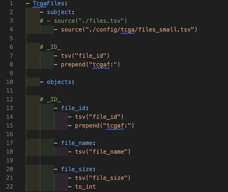

# TCGA RDF Conversion Guide

## TCGA

The Cancer Genome Atlas (TCGA) provides large-scale genetic data to study cancer-related mutations and expression patterns.

## RDF Conversion with RDF-config

Install **rdf-config** to convert TCGA data into RDF (Turtle) or JSON-LD.
Download the data separately.

### About RDF-config (senbero)

[RDF-config](https://github.com/dbcls/rdf-config) is a tool that generates

- SPARQL queries
-  Schema diagrams (ASCII / SVG)
- Configuration files for:
    - [Grasp](https://github.com/dbcls/grasp)
    - [TogoStanza](http://togostanza.org/)
    - [ShEx Validator](https://shex.io/) 

These are generated from **simple YAML configuration files**.

📘 For YAML syntax and configuration rules, see the RDF-config Specification:

[English](https://github.com/dbcls/rdf-config/blob/master/doc/spec.md) | [Japanese](https://github.com/dbcls/rdf-config/blob/master/doc/spec_ja.md)

### Installation of rdf-config

💡 Run the following commands in your working directory (e.g., ~/rdf-config/):

```
git clone https://github.com/dbcls/rdf-config.git
cd rdf-config
bundle install
```

## Download and TCGA Datasets

⚠️Save all `.tsv` files into: `rdf-config/config/tcga`.

### Step I: Define Your Cohort on GDC


1. Go to the [GDC Data Portal](https://portal.gdc.cancer.gov/)

2. Open the Projects tab (①).

3. Under PROGRAM, check ✅ TCGA (②).

4. Under PROJECT, select All 33 Projects (③).

5. Click "Save New Cohort" and assign a name (④).

### Step II. Explore Cohort Summary

Click on 11,428 CASES to explore cohort details (⑤).

## Dataset Preparation

#### manifest.tsv

1. Click "713,891 Files" → "Download Manifest" (⑥).

The downloaded file will be named something like gdc_manifest.YYYY-MM-DD.hhmmss.txt.

(e.g., gdc_manifest.2025-06-20.143000.txt).

2. Use the following script to add the "mani_" prefix to each column.

```
python3 add_manifest_prefix.py
```

**Output**: `gdc_manifest.YYYY-MM-DD.tsv`

#### sample.tsv (Biospecimen)

1. Click "Biospecimen" → Download "JSON" (⑦).

2. Convert the JSON to TSV with smpl_ prefixes:

```
python3 python3 json-samples.tsv.py
```

**Output**: `sample.tsv`

#### files.tsv

1. Download File Metadata from GDC API (⑧).

```
python3 dl_tcga_files_json.py
```

**Output**: `files.tcga.all.json`

2. Convert JSON to tsv

```
python3 json_to_files_tsv.py files.tcga.all.json > files.tsv
```

**Output**: `files.tsv`

#### clinical.tsv

1. Download Clinical data in both "TSV" and "JSON" formats (⑨).

2. Compare Missing Fields

Use the script to compare fields between old and new TSVs.

```
python3 compare_column_2.py
```

* **Output**: `gdc_additional_fields_output.txt`

3. Add missing fields to TSV

Use:

```
python3 clinical_add_pathology_fields.py
```

* **Output**: `clinical_expanded_final.tsv`

```
Key Operations in `clinical_add_pathology_fields.py`:
    - Strip `cases.` prefix from `case_id`
    - Extract missing fields (assign `None` if not found)
    - Alphabetically sort additional fields
    - Append fields without duplicating `case_id`
    - Rename: `clin_` + last key in path
        - If conflict: use full path with `_`
    - Replace `--` with an empty string
    - Add fields like `clin_case_id___hoge` for uniqueness   
```

## Update RDF Conversion Configurations

### 1. Edit Field Types

```
python3 convert_rule_list.py
```

* **Output**: `rule_list.tsv`

Refer to official [GDC dictionary schemas](https://github.com/NCI-GDC/gdcdictionary/blob/develop/src/gdcdictionary/schemas/diagnosis.yaml) (e.g., `demographic.yaml`, `treatment.yaml`) to verify types.

Update the `rules` section in `clinical_tsv_to_yaml.py`.

```
python3 clinical_tsv_to_yaml.py
```

* **Output**: `clin_convert.yaml`

### 2. Update `convert.yaml`

Replace the clinical section in the main `convert.yaml` with the updated rules.

### 3. Update model.yaml

```
python3 generate_model_yaml.py
```

* **Output**: `clinical_model.yaml`

Replace the clinical section in the main model.yaml.

## Convert to RDF / JSON-LD

### Required Config Files

Ensure the following files exist in config/tcga/:
* convert.yaml
* model.yaml
* prefix.yaml
* endpoint.yaml
* schema.yaml
* sparql.yaml
* stanza.yaml

### RDF/JSON-LD Conversion Commands

💡 Note: Run from the root directory of rdf-config.

Convert TSV to Turtle:
```
bundle exec rdf-config --config config/tcga --convert --format turtle > config/tcga/output.ttl
```

Convert TSV to JSON-LD:

```
bundle exec rdf-config --config config/tcga --convert --format json-ld > config/tcga/output.json
```

## Visualize the Schema

### Generate ASCII Schema Diagram

```
bundle exec rdf-config --config config/tcga --senbero
```

```
TcgaFiles [tcgaf:TcgaFiles] (tcgaf:1)
    |-- tcgaf:file_id
    |       `-- file_id (tcgaf:a9de4ee0-bf86-482...)
    |-- tcgaf:file_name
    |       `-- file_name ("TCGA_LUSC.eaf3905...")
    |-- tcgaf:file_size
    |       `-- file_size (401704810042)
    |-- ...
TcgaManifeset [tcgam:TcgaManifest] (tcgam:1)
    |-- tcgam:mani_id
    |       `-- mani_id (tcgam:a9de4ee0-bf86-482...)
    |-- tcgam:mani_filename
    |       `-- mani_filename ("TCGA_LUSC.eaf3905...")
    |-- tcgam:mani_md5
    |       `-- mani_md5 ("d3ee6b811a08c6e3c...")
    |-- ...
```

### Generate SVG schema diagram

```
bundle exec rdf-config --config config/tcga --schema > tcga.svg
```

📍Output:[tcga.svg](./doc/figure/tcga.svg)


### Tips for Writing convert.yaml

- Always use a hyphen `-` before **top-level** entities (e.g., `- TcgaFiles:`)
- Use 2 spaces (not tabs) for indentation
- Define `- subject:` and `- objects:` under each entity
- Ensure `source:` matches the TSV file field name



### Generate Sample Data for Testing
You can create a small subset of the TSV data to test RDF conversion using:

```
python3 ./generate_tcga_small_data.py
```

**output_file**
- small_manifest.tsv
- small_sample.tsv
- small_files.tsv
- small_clinical.tsv
